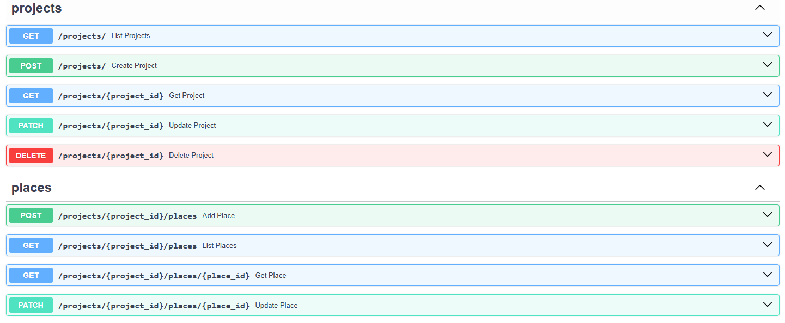

# Travel Planner API

Management application that helps travellers plan trips and collect desired places to visit.  
A system to manage travel projects, places retrieved from a public API, and notes that users attach to places.

## Tech Stack

- Python 3.13
- FastAPI
- PostgreSQL
- SQLAlchemy (async)
- Alembic
- Docker & Docker Compose

## Quick Start
### 1. Clone the repository

```bash
git clone https://github.com/LobiSZ9Iblami/travel_planner
```

### 2. Env setup
```
# Server settings
HOST=0.0.0.0
PORT=8000
RELOAD=True
ALLOWED_ORIGINS=http://localhost, http://127.0.0.1

# Postgres settings
POSTGRES_DB=postgres
POSTGRES_USER=postgres
POSTGRES_PASSWORD=postgres
POSTGRES_PORT=5432
POSTGRES_HOST=postgres
```

### 3. Run Docker

```commandline
docker compose up --build
```

#### Docker Services  
```app``` → FastAPI application  
```app_db``` → PostgreSQL database

### 4. Run migrations
```commandline
docker compose exec app alembic upgrade head
```

### 5. API Documentation
```commandline
http://localhost:8000/docs
```
#### Endpoints:



### 6. This project uses the Art Institute of Chicago API to validate and fetch artwork data:

```https://api.artic.edu/docs/#collections```

Example endpoint used:

```GET: https://api.artic.edu/api/v1/artworks/search```